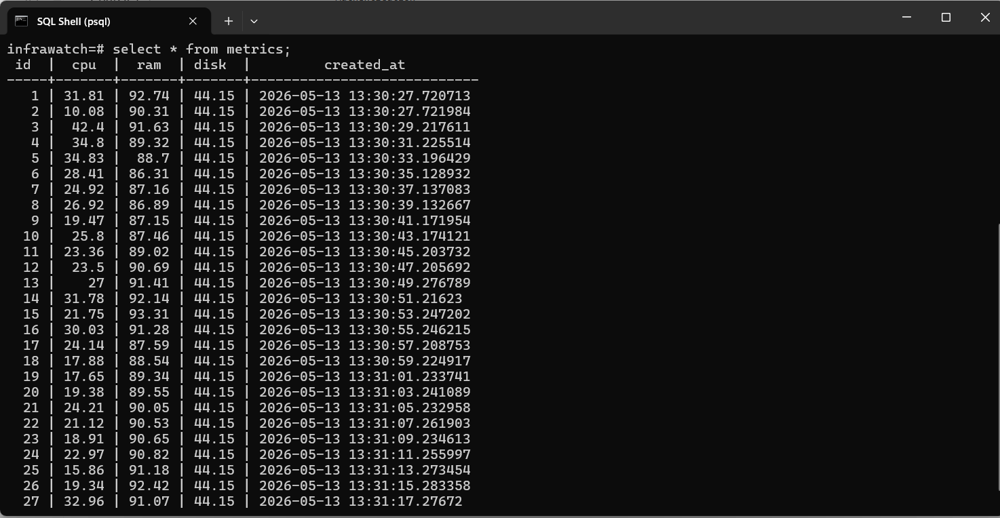
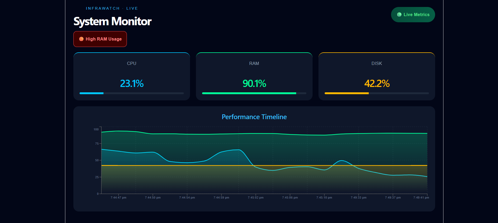

# InfraWatch

InfraWatch is a realtime infrastructure observability platform designed for monitoring system-level resource utilization through live telemetry streaming, persistent metric storage, and operational alerting.

The platform collects and visualizes critical infrastructure metrics including CPU utilization, memory consumption, and disk usage through a low-latency telemetry pipeline powered by WebSockets and PostgreSQL-backed persistence.

InfraWatch demonstrates practical concepts used in modern monitoring systems such as realtime telemetry ingestion, metric persistence, operational alerting, and observability dashboard design.

---

# 🚀 Capabilities

## 📡 Realtime Telemetry Streaming
- Continuous CPU utilization monitoring
- Live memory consumption tracking
- Disk utilization analytics
- Low-latency websocket-based metric delivery

## 📊 Observability Dashboard
- Time-series metric visualization
- Realtime infrastructure analytics
- Smoothed telemetry rendering
- Live operational metric cards

## 🚨 Operational Alerting
- Threshold-based alert evaluation
- High resource utilization detection
- Realtime operational notifications
- Dynamic monitoring indicators

## 🗄 Telemetry Persistence
- PostgreSQL-backed metric storage
- Historical telemetry retrieval
- Structured metric retention pipeline

## 🎨 Monitoring Interface
- Responsive observability dashboard
- Dark-themed monitoring workspace
- Optimized rendering pipeline
- Live metric visualization components

---

# 🛠 Technology Architecture

## Client Layer
- React
- Recharts
- Socket.IO Client
- Vite

## Telemetry Server
- Node.js
- Express
- Socket.IO
- systeminformation

## Persistence Layer
- PostgreSQL

---

# 📊 System Flow

```txt
Observability Dashboard
            ↓
Realtime Telemetry Transport Layer
            ↓
Telemetry Collection Server
            ↓
PostgreSQL Persistence Layer
```

---

# ⚙ Operational Workflow

1. Infrastructure metrics are continuously collected from the host system using low-level telemetry utilities.

2. Collected telemetry is streamed to connected dashboard clients through Socket.IO websocket channels.

3. Metrics are persisted into PostgreSQL for historical analytics and time-series retrieval.

4. The monitoring interface renders live telemetry using dynamic visualization components.

5. Operational thresholds are evaluated continuously to detect abnormal infrastructure behavior.

---

# 📸 Screenshots

## PostgreSQL Metric Storage



## InfraWatch Monitoring Dashboard



---

# ⚡ Local Deployment

## Clone Repository

```bash
git clone <repository-url>
```

---

## Client Runtime

```bash
cd client
npm install
npm run dev
```

Client runtime:
```txt
http://localhost:5173
```

---

## Telemetry Server Runtime

```bash
cd server
npm install
npm start
```

Server runtime:
```txt
http://localhost:5000
```

---

# 🗃 Database Initialization

Create PostgreSQL database:

```sql
CREATE DATABASE infrawatch;
```

Create telemetry table:

```sql
CREATE TABLE metrics (
  id SERIAL PRIMARY KEY,
  cpu DECIMAL,
  ram DECIMAL,
  disk DECIMAL,
  created_at TIMESTAMP DEFAULT CURRENT_TIMESTAMP
);
```

Configure environment variables inside:

```txt
server/.env
```

Example:

```env
DB_USER=postgres
DB_HOST=localhost
DB_NAME=infrawatch
DB_PASSWORD=yourpassword
DB_PORT=5432
```

---

# 📌 Planned Enhancements

- Containerized deployment pipeline
- Distributed telemetry aggregation
- Multi-node infrastructure monitoring
- Authentication and access control
- Redis-backed caching layer
- Kubernetes deployment support
- Advanced analytics dashboards

---

# 👨‍💻 Author

Steeve Baby